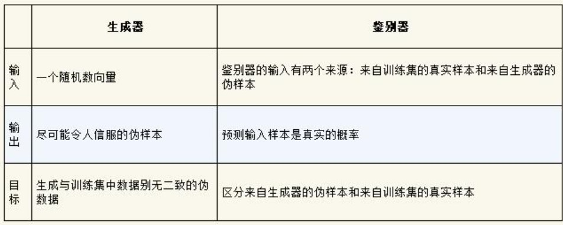
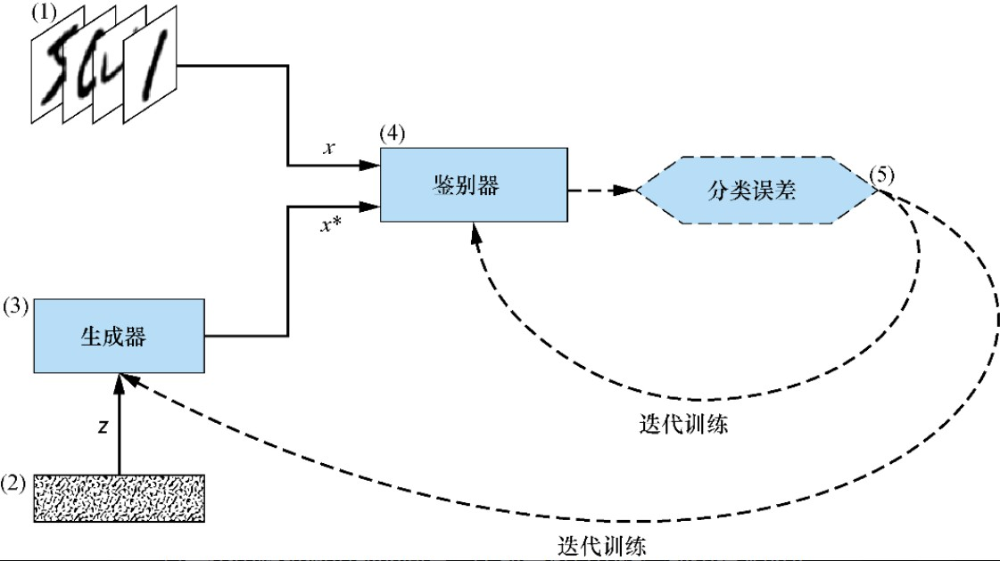
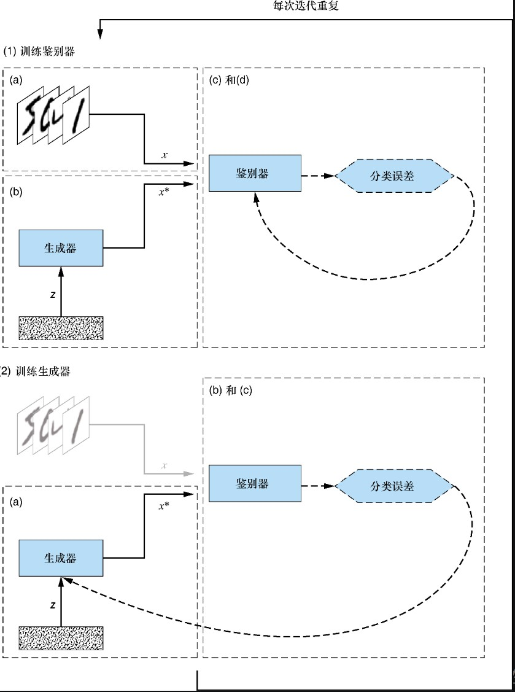

图1.1 生成器与鉴别器的关键信息图1.1 生成器与鉴别器的关键信息图1.1 生成器与鉴别器的关键信息图1.1 生成器与鉴别器的关键信息# 第一章 GAN简介

## 1.1 什么是GAN

GAN是一类由两个同时训练的模型组成的机器学习技术：一个是**生成器（generator）**，训练其生成伪数据；另一个是**鉴别器（**discriminator**）**，训练其从真实数据中识别伪数据。

**生成（generative）**：生成新数据；

**对抗（adversarial）**：生成器与鉴别器对抗；

**网络（network）**：神经网络。

## 1.2 GAN是如何工作的

生成器的目标是生成能最大程度有效捕捉训练集特征的样本，以至于生成出的样本与训练数据别无二致。图1.1总结了生成器与鉴别器的关键信息。

## 1.3 GAN实战

GAN的核心结构如图1.2所示。

（1） **训练数据集**——包含真实样本的数据集，希望生成器去学习模仿的数据集。

（2） **随机噪声向量**——生成器网络的初始输入。此输入是一个由随机数组成的向量，生成器将其用作合成伪样本的起点。

（3） **生成器网络**——接收随机数向量作为输入，并输出伪样本。目标是生成和真实样本别无二致的伪样本。

（4） **鉴别器网络**——鉴别器接收来自训练集的真实样本**或**生成器生成的伪样本作为输入。对每个样本，鉴别器会进行判定并输出其为真实的概率。

（5） **迭代训练/调优**——衡量鉴别器的预测效果，并反向传播给鉴别器和生成器进行迭代优化。

### 1.3.1 GAN的训练

对于每次训练迭代，执行如下操作。

1. 训练鉴别器

   a. 从训练集中随机抽取真实样本x。

   b. 获取一个新的随机噪声向量z，用生成器网络合成一个伪样本$x^*$。

   c. 用鉴别器网络对x和$x^*$进行分类。

   d. 计算分类误差并反向传播总误差以更新鉴别器的权重和偏置，寻求**最小化**分类误差。
2. 训练生成器

    a. 获取一个新的随机噪声向量z，用生成器网络合成一个伪样本$x^*$。

    b. 用鉴别器网络对$x^*$进行分类。

    c. 计算分类误差并反向传播以更新生成器的权重和偏置，寻求**最大化**鉴别器误差。

3. 结束

GAN训练算法如图1.3所示：

### 1.3.2 达到平衡

生成器与鉴别器多抗过程是一个**零和博弈**过程，即一方的收益等于另一方的损失。当一方提高一定程度时，另一方会恶化同样的程度。零和博弈都有一个**纳什均衡点**，那就是任何一方无论怎么努力都不能改善他们的处境或者结果。

当满足以下条件时，GAN达到**纳什均衡**。

（1）生成器生成的伪样本与训练集中的真实数据别无二致。

（2）鉴别器所能做的只是随机猜测一个特定的样本是真的还是假的（也就是说，猜测一个示例为真的概率是50%）。

## 1.4 为什么要学GAN

除用于生成图片外，GAN还可以实现**图像到图像的转换**（image-to-image translation）。

## 1.5 小结

（1）GAN是一种利用两个神经网络之间的动态竞争来合成真实数据样本的深度学习技术，例如能合成具有照片级真实感的虚假图像。构成一个完整GAN的两个网络如下：

生成器，其目标是通过生成与训练数据集别无二致的数据来欺骗鉴别器；

鉴别器，其目标是正确区分来自训练数据集的真实数据和由生成器生成的伪数据。

（2）目前，GAN在许多不同的领域都有着广泛的应用，如时尚、医药和网络安全等。
