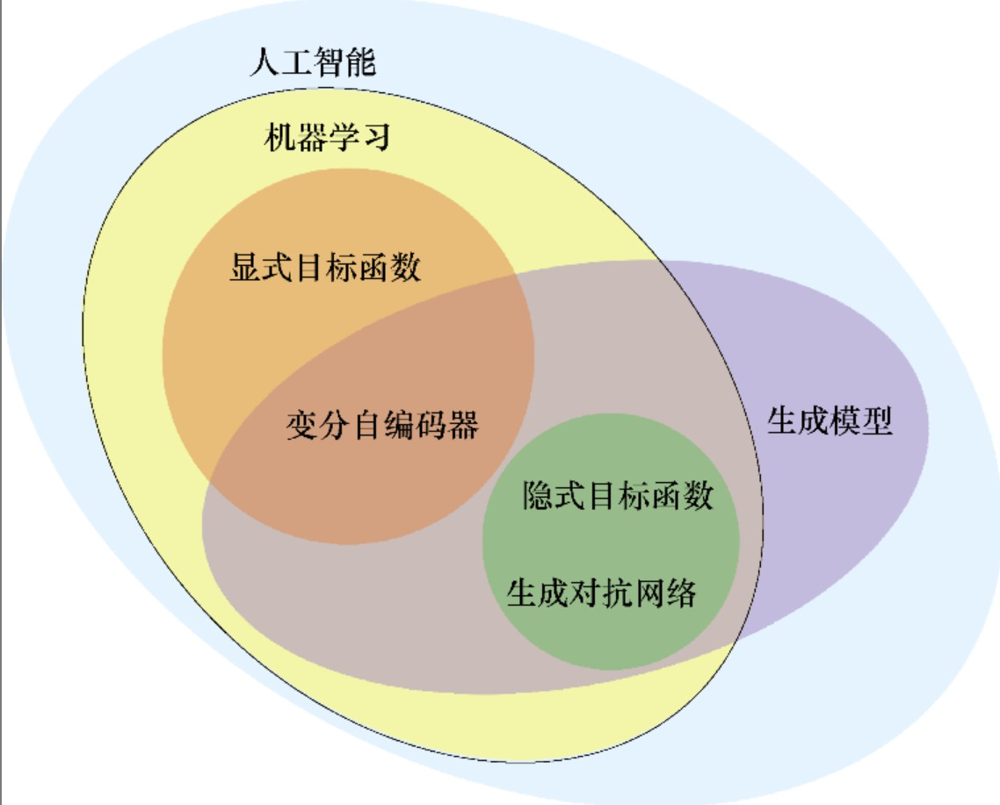
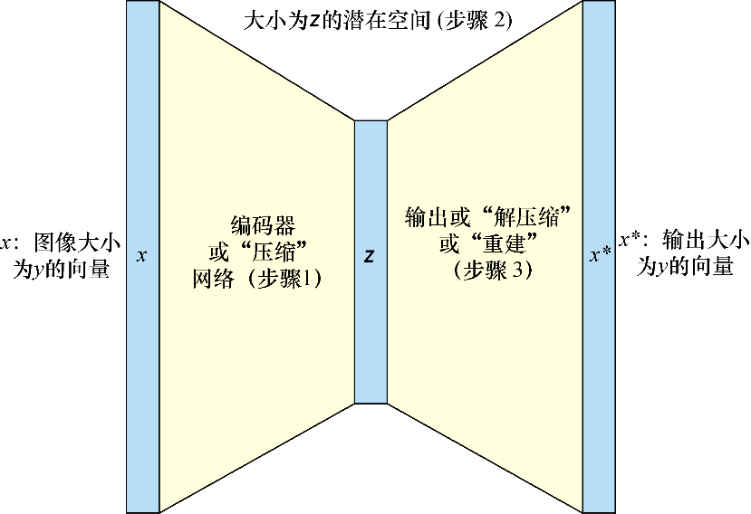
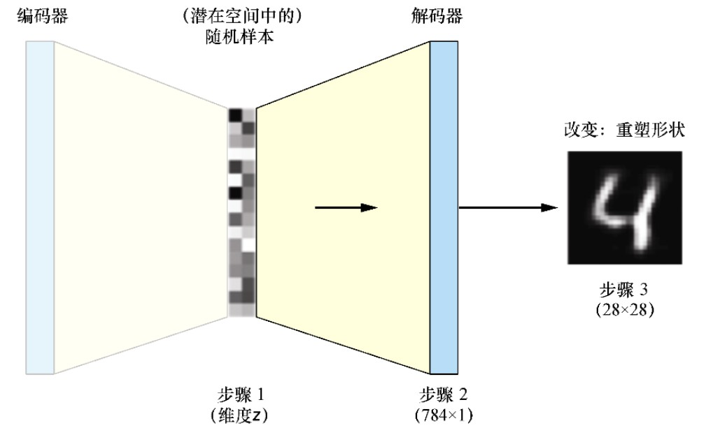

# 第2章　自编码器生成模型入门

## 2.1 生成模型简介

从要生成内容的描述指令开始，最后在转换系统的另一端得到图像。这是最简单、最非正式的**生成模型。**

正式来说，取一个特定的描述指令$(z)$，并尝试得到一个生成的样本$(x^*)$。理想情况下，$x^*$应该与真实样本$x$看起来一样真实。描述指令$z$是**潜在空间**（latent space）中的某个激励，但不会总得到相同的输出$(x^*)$。

上述第一章中的随机噪声向量通常称为**来自潜在空间的样本**。潜在空间是数据点的一种更简单的隐式表示，它用$z$表示。

## 2.2 自编码器如何用于高级场景

**自编码器**可以帮助兑数据进行自动编码，由编码器和解码器组成。通过传入概念$x$并查看他们是否能成功地以有意义的方式重现概念$x^*$，来训练他们的“自编码器”。这样就可以测量误差，这称为**重建损失($\lVert x-x^* \rVert)$)**。

**潜在空间**是数据的隐式表示。自编码器不是在未压缩的版本中表达单词或图像（例如机器学习工程师，或图像的JPEG编解码器），而是**根据对数据的理解来对其进行压缩和聚类。**

## 2.3 什么是GAN的自编码器

自编码器与GAN的关键区别：自编码器用一个损失函数对整个自编码器网络进行端到端的训练；GAN的生成器和鉴别器分别有损失函数。两者在AI图景中的范围如图2.1所示：



## 2.4 自编码器的形成

自编码器的结构如图2.2所示：



（1）编码器网络：取一个表示$x$（如一个图像），然后用学过的编码器（通常是一个单层或多层的神经网络）将维数从$y$减小到$z$。

（2）潜在空间$(z)$：在训练时，试图建立具有一定意义的潜在空间。潜在空间通常是有较小维度的表示，起着中间步骤的作用。

（3）解码器网络：用解码器将原始对象重建到原始的维度，这通常由一个神经网络完成。它是编码器的镜像，对应着从$z$到$x^*$的步骤。

下面给出一个自编码器训练过程的示例：

（1）将图像[插图]通过自编码器输入。

（2）得到$x^*$，即重建的图像。

（3）评估重建损失，即$x$和$x^*$之间的差异：使用图像$x$和$x^*$的像素之间的距离（如MAE）完成；给了一个显式的目标函数$\lVert(x-x^*)\rVert$，以通过梯度下降的形式进行优化。

## 2.5 自编码器的使用

## 2.6 无监督学习

**无监督学习**（unsupervised learning）是一种从数据本身学习而不需要关于这些数据含义的附加标签的机器学习。例如，聚类是无监督的，因为只是试图揭示数据的底层表示；异常检测是有监督的，因为需要人工标记的异常情况。

### 2.6.1 吐故纳新

自编码器由两个神经网络组成：编码器和解码器。在本书示例中，两者都具有激活函数，且只为每个函数使用一个中间层。

如果每个网络都只有一个权重矩阵，那么过程将类似于一种名为**主成分分析**（Principal Component Analysis，PCA）的成熟分析技术。

### 2.6.2 使用自编码器生成

在一组图像上训练自编码器，调整编码器和解码器的参数，以找到适合两个网络的参数。自编码器生成过程如图2.3所示：



### 2.6.3 变分自编码器

在变分自编码器的情况下，将潜在空间表示为一个习得的平均值和标准差的分布，而不仅仅是一组数字。变分自编码器是一种基于贝叶斯机器学习的技术。

## 2.7 代码就是生命

首先导入所有依赖项：

```python
from __future__ import print_function
import numpy as np
import matplotlib.pyplot as plt
from scipy.stats import norm
import tensorflow as tf
```

```python
from keras.layers import Input, Dense, Lambda
from keras.models import Model
from keras import backend as K
from keras import objectives
from keras.datasets import mnist
```

下一步设置全局变量和超参数：

```python
batch_size = 100
original_dim = 28*28    # MNIST图像的高x宽
latent_dim = 2
intermediate_dim = 256
nb_epoch = 5
epsilon_std = 1.0
```

```python
# 定义采样辅助函数
def sampling(args: tuple):
    z_mean, z_log_var = args
    epsilion = K.random_normal(shape=(K.shape(z_mean)[0], latent_dim), mean=0.,
                                                        stddev=epsilon_std)
    return z_mean + K.exp(z_log_var / 2) * epsilion
```

简单的用法是先简单地声明每个层，将前面的层作为常规参数之后的第二组参数，例如层h将x作为输入。最后当编译模型并指出模型的起点[插图]和终点（[z_mean, z_log_varand z]）时，Keras将会明白起始输入和最终列表输出是如何连接在一起的。[插图]是潜在空间，在本示例中是一个由均值和方差定义的正态分布。

现在定义编码器：

```python
# 定义编码器
x = Input(shape=(original_dim,), name="input") # 编码器的输入
h = Dense(intermediate_dim, activation='relu', name="encoding")(x) # 中间层
z_mean = Dense(latent_dim, name="mean")(h) # 定义潜在空间的均值
z_log_var = Dense(latent_dim, name="log-variance")(h) # 定义潜在空间的log variance
z = Lambda(sampling, output_shape=(latent_dim,))([z_mean, z_log_var])
encoder = Model(x, [z_mean, z_log_var, z], name="encoder")
encoder.summary()
```

从潜在空间采样后将这些信息传递给解码器。但是z_mean和z_log_var是如何连接的：它们都是由有两个节点的全连接层与层h连接的，这是正态分布的定义特征——均值和方差。为此创建采样辅助函数。学习的是均值（μ）和方差（σ）。这个整体实现中，我们有一个$z$通过采样函数连接z_mean和z_log_var，这样既可以训练，又可以接着有效采样，以在最后得到一些看上去很优雅的数字。

编写解码器，首先将之前的层写为变量，以便稍后生成时重新使用。

```python
# 解码器的输入
input_decoder = Input(shape=(latent_dim,), name="decoder_input")
# 潜在空间转化为中间维度
decoder_h = Dense(intermediate_dim, activation='relu', name="decoder_h")(input_decoder)
# 得到原始维度的平均值
x_decoded = Dense(original_dim, activation='sigmoid', name="flat_decoded")(decoder_h)
# 将解码器定义为一个Keras模型
decoder = Model(input_decoder, x_decoded, name="decoder")
decoder.summary()
```

现在把编码器和解码器组合为一个VAE模型：

```python
# 抓取输出需要获取第三个元素，即采用z
output_combined = decoder(encoder(x)[2])
# 连接输入和总输出
vae = Model(x, output_combined)
# 输出模型的整体结构
vae.summary()
```

接下来定义损失函数，这样自编码器就可以训练了：

```python
# 接下来定义损失函数，这样自编码器就可以训练了
def vae_loss(x: tf.Tensor, x_decoded_mean: tf.Tensor,
                        z_log_var=z_log_var, z_mean=z_mean,
                        original_dim=original_dim):
    xent_loss = original_dim * objectives.binary_crossentropy(x, x_decoded_mean)
    kl_loss = -0.5 * K.sum(1 + z_log_var - K.square(z_mean) - K.exp(z_log_var), axis=-1)
    vae_loss = K.mean(xent_loss + kl_loss)
    return vae_loss

vae.compile(optimizer='rmsprop', loss=vae_loss)
vae.summary()
```

可以看到，二元交叉熵和KL散度加在一起组成整体损失。KL散度衡量分布之间的差异。

**KL散度**（Kullback–Leibler divergence, KL divergence）又名相对熵，是两个分布的交叉熵与其自身熵的差异。

拆分训练集/测试集和输入归一化的标准操作对模型进行训练：

```python
(x_train, y_train), (x_test, y_test) = mnist.load_data()

x_train = x_train.astype('float32') / 255
x_test = x_test.astype('float32') / 255
x_train = x_train.reshape((len(x_train), np.prod(x_train.shape[1:])))
x_test = x_test.reshape((len(x_test), np.prod(x_test.shape[1:])))
```

对数据进行归一化操作，并将训练集和测试集中的样本从28×28的矩阵调整大小为784位长的数组。

应用fit函数，使用shuffle获得一个真实的无序数据集。在训练过程中，用验证集数据加以监测：

```python
vae.fit(x_train, x_train,
        shuffle=True,
        epochs=epochs,
        batch_size=batch_size)
```

## 2.9 小结

（1）高级自编码器由编码器、潜在空间和解码器组成。使用常用目标函数来训练自编码器，该目标函数可以测量再现数据和原始数据之间的距离。

（2）自编码器有许多应用，也可以用作生成模型。在实践中这往往不是其主要用途，因为其他方法（尤其是GAN）对生成任务更为擅长。

（3）可以使用Keras编写简单的变分自编码器生成手写数字。

（4）VAE的局限性促使我们的研究向GAN迈进。
