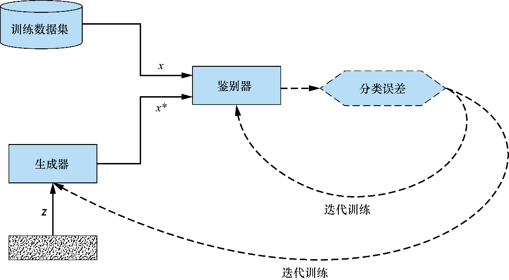
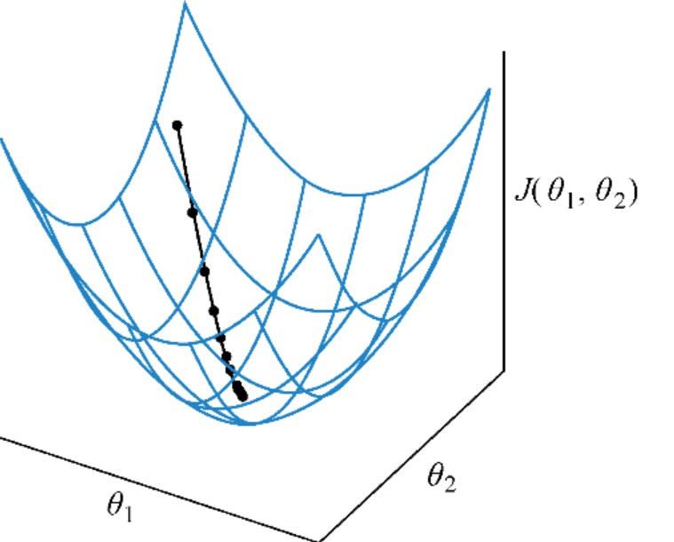
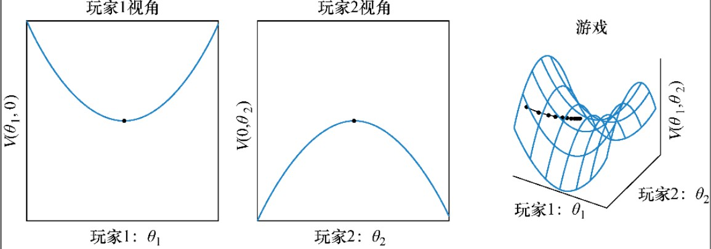
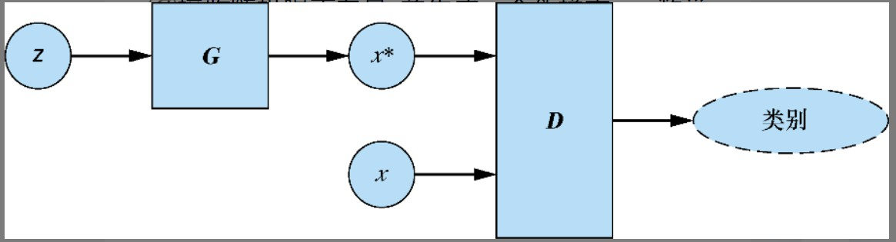

# 第3章 第一个GAN模型：生成手写数字

## 3.1 GAN的基础：对抗训练

形式上，生成器和鉴别器由可微函数表示如神经网络，它们都有自己的代价函数。这两个网络是利用鉴别器的损失进行反向传播训练。鉴别器努力使真实样本输入和伪样本输入带来的损失最小化，而生成器努力使它生成的伪样本造成的鉴别器损失最大化。如图3.1所示：



### 3.1.1 代价函数

遵循标准的表示形式，用$J^{(G)}$表示生成器的代价函数；用$J^{(D)}$表示鉴别器的代价函数。两个网络的训练参数（权重和偏置）用希腊字母表示：$\theta ^{(G)}$表示生成器；$\theta^{(D)}$表示鉴别器。

GAN在两个关键方面不同于传统的神经网络。

第一，代价函数$J$，传统神经网络的代价函数仅根据其自身可训练的参数定义，数学表示为$J^{(\theta)}$。相比之下，GAN由两个网络组成，其代价函数依赖于两个网络的参数。也就是说，生成器的代价函数是$J^{(G)}(\theta^{(G)}, \theta^{(D)})$，而鉴别器的成本函数是$J^{(D)}(\theta^{(G)}, \theta^{(D)})$。

第二，在训练过程中，传统的神经网络可以调整它的所有参数$θ$。在GAN中，每个网络只能调整自己的权重和偏置。也就是说，在训练过程中，生成器只能调整$\theta^{(G)}$，鉴别器只能调整$\theta^{(D)}$。因此，每个网络只控制了决定损失的部分参量。

### 3.1.2 训练过程

传统神经网络的训练是一个优化问题，通过寻找一组参数来最小化代价函数，移动到参数空间中的任何相邻点都会增加代价。这可能是参数空间中的局部或全局最小值，由寻求最小化使用的代价函数所决定。最小化代价函数的优化过程如图3.2所示。



因为生成器和鉴别器只能调整自己的参数而不能相互调整对方的参数，所以GAN训练可以用一个博弈过程来更好地描述，而非优化。

当两个网络达到纳什均衡时GAN训练结束，在纳什均衡点上，双方都不能通过改变策略来改善自己的情况。从数学角度来说，发生在这样的情况下——生成器的可训练参数$\theta ^{(G)}$对应的生成器的代价函数$J^{(G)}(\theta^{(G)}, \theta^{(D)})$最小化；同时，对应该网络参数$\theta^{(D)}$下的鉴别器的代价函数$J^{(D)}(\theta^{(G)}, \theta^{(D)})$也得到最小化。图3.3说明了二者零和博弈的建立和达到纳什均衡的过程。



## 3.2 生成器和鉴别器

生成器$(G)$接收随机噪声向量$z$并生成一个伪样本$x^*$，即数学上可表示为：$G(z)=x^*$。鉴别器$(D)$的输入要么是真实样本$x$，要么是伪样本$x^*$；对于每个输入，它输出一个介于0和1之间的值，表示输入是真实样本的概率。图 3.4用刚才介绍的术语和符号描述了GAN架构。



### 3.2.1 对抗的目标

鉴别器的目标是尽可能精确。对于真实样本$x$，$D(x)$力求尽可能接近1（正标签）；对于伪样本$x^*$，$D(x^*)$力求尽可能接近0（负标签）。

生成器的目标正好相反，它试图通过生成与训练数据集中的真实数据别无二致的伪样本$x^*$来欺骗鉴别器。从数学角度讲，即生成器试图生成假样本$x^*$，使得$D(x^*)$尽可能接近1。

### 3.2.2 混淆矩阵

鉴别器的分类可以用混淆矩阵来表示，混淆矩阵是二元分类中所有可能结果的表格。鉴别器的分类结果如下：

（1）**真阳性**（true positive）——真实样本正确分类为真，$D(x) \approx 1$；

（2）**假阴性**（false negative）——真实样本错误分类为假，$D(x) \approx 0$；

（3）**真阴性**（true negative）——伪样本正确分类为假，$D(x^*) \approx 0$；

（4）**假阳性**（false positive）——伪样本错误分类为真，$D(x^*) \approx 1$；

使用混淆矩阵的术语，鉴别器试图最大化真阳性和真阴性分类，这等同于最小化假阳性和假阴性分类。相反，生成器的目标是最大化鉴别器的假阳性分类，这样生成器才能成功地欺骗鉴别器，使其相信伪样本是真的。

## 3.3 GAN训练算法

GAN训练算法的执行流程为：

对于每次训练迭代，执行：

1. 训练鉴别器。

* 取随机的小批量的真是样本x；
* 取随机的小批量的随机噪声$z$，并生成一小批量伪样本：$G(z)=x^*$；
* 计算$D(x)$和$D(x^*)$的分类损失，并反向传播总误差以更新$\theta^{(D)}$来最小化分类损失。

2. 训练生成器

* 取随机的小批量的随机噪声$z$生成一小批量伪样本：$G(z)=x^*$；
* 用鉴别器网络对$x^*$进行分类；
* 计算$D(x^*)$的分类损失，并反向传播总误差以更新$\theta^{(G)}$来最大化分类损失。

结束

注意，在步骤1中训练鉴别器时，生成器的参数保持不变；同样，在步骤2中，在训练生成器时保持鉴别器的参数不变。

## 3.4 教程：生成手写数字

### 3.4.1 导入模块并指定模型输入维度

```python
import matplotlib.pyplot as plt
import numpy as np

from keras.datasets import mnist
from keras.layers import Dense, Flatten, Reshape
from keras.layers.advanced_activations import LeakyReLU
from keras.models import Sequential
from keras.optimizers import Adam
```

然后指定模型和数据集的输入维度，MNIST中的每个图像都是28×28像素的单通道图像（灰度图）。变量z_dim设置了噪声向量$z$的大小。

```python
img_rows = 28
img_cols = 28
channels = 1

# 输入图片维度
img_shape = (img_rows, img_cols, channels)

# 噪声向量的大小用作生成器的输入
z_dim = 100
```

### 3.4.2 构造生成器

简而言之，生成器是一个只有一个隐藏层的神经网络，生成器以$z$为输入，生成28×28×1的图像。在隐藏层中使用**LeakyReLU**激活函数。与将任何负输入映射到0的常规**ReLU**函数不同，**LeakyReLU**函数允许存在一个小的正梯度，这样可以防止梯度在训练过程中消失，从而产生更好的训练效果。

在输出层使用**tanh**激活函数，它将输出值缩放到范围[–1, 1]。之所以使用**tanh**（与**sigmoid**不同，**sigmoid**会输出更为典型的0到1范围内的值），是因为它有助于生成更清晰的图像。

```python
def build_generator(img_shape, z_dim):
    model = Sequential()

    # 全连接层
    model.add(Dense(128, input_dim=z_dim))

    # LeakyReLU激活函数
    model.add(LeakyReLU(alpha=0.01))

    # 带tanh函数的输出层
    model.add(Dense(28 * 28 * 1, activation='tanh'))

    # 生成器的输出改变为图像尺寸
    model.add(Reshape(img_shape))

    return model
```

### 3.4.3 构造鉴别器

鉴别器接收28×28×1的图像，并输出表示输入是否被视为真而不是假的概率。鉴别器由一个两层神经网络表示，其隐藏层有128个隐藏单元及激活函数为**LeakyReLU**。

在大多数GAN的实现中，生成器和鉴别器网络体系结构的大小和复杂性都相差很大。

鉴别器的输出层应用了**sigmoid**激活函数。这确保了输出值将介于0和1之间，可以将其解释为生成器将输入认定为真的概率。在大多数GAN的实现中，生成器和鉴别器网络体系结构的大小和复杂性都相差很大

```python
def build_discriminator(img_shape):
    model = Sequential()

    # 输入图像展平
    model.add(Flatten(input_shape=img_shape))

    # 全连接层
    model.add(Dense(128))
  
    # LeakyReLU激活函数
    model.add(LeakyReLU(alpha=0.01))

    # 带sigmoid函数的输出层
    model.add(Dense(1, activation='sigmoid'))

    return model
```

### 3.4.4 搭建整个模型

构建并编译先前实现的生成器模型和鉴别器模型。

注意：在用于训练生成器的组合模型中，通过将 `discriminator.trainable`设置为False来固定鉴别器参数。还要注意的是，组合模型（其中鉴别器设置为不可训练）仅用于训练生成器。鉴别器将用单独编译的模型训练。（当回顾训练循环时，这一点会变得很明显。）

使用二元交叉熵作为在训练中寻求最小化的损失函数。**二元交叉熵**（binary cross-entropy）用于度量二分类预测计算的概率和实际概率之间的差异；交叉熵损失越大，预测离真值就越远。

优化每个网络使用的是**Adam优化算法**。该算法名字源于**adaptive moment estimation**，这是一种先进的基于梯度下降的优化算法，Adam凭借其通常优异的性能已经成为大多数GAN的首选优化器。

```python
# 构建并编译GAN
def build_gan(generator, discriminator):
    model = Sequential()

    # 生成器模型与鉴别器模型结合在一起
    model.add(generator)
    model.add(discriminator)

    return model

# 构建并编译鉴别器
discriminator = build_discriminator(img_shape)
discriminator.compile(loss='binary_crossentropy',
                                            optimizer=Adam(),
                                            metrics=['accuracy'])

# 构建生成器
generator = build_generator(img_shape, z_dim)

# 训练生成器时保持鉴别器的参数固定
discriminator.trainable = False

# 构建并编译鉴别器固定的GAN模型，以训练生成器
gan = build_gan(generator, discriminator)
gan.compile(loss='binary_crossentropy', optimizer=Adam())
```

### 3.4.5 训练

首先，取随机小批量的MNIST图像为真实样本，从随机噪声向量$z$中生成小批量伪样本，然后在保持生成器参数不变的情况下，利用这些伪样本训练鉴别器网络。其次，生成一小批伪样本，使用这些图像训练生成器网络，同时保持鉴别器的参数不变。算法在每次迭代中都重复这个过程。

我们使用独热编码（one-hot-encoded）标签：1代表真实图像，0代表伪图像。$z$从标准正态分布（平均值为0、标准差为1的钟形曲线）中取样得到。训练鉴别器使得**假**标签分配给伪图像，**真**标签分配给真图像。对生成器进行训练时，生成器要使鉴别器能将真实的标签分配给它生成的伪样本。

**注意**：训练数据集中的真实图像被重新缩放到了−1到1。如前例所示，生成器在输出层使用tanh激活函数，因此伪样本同样将在范围(−1，1)内。相应地，就得将鉴别器的所有输入重新缩放到同一范围。

```python
# GAN训练循环
losses = []
accuracies = []
iteration_checkpoints = []

def train(iterations, batch_size, sample_interval):

    # 加载MINST数据集
    (X_train, _), (_, _) = mnist.load_data()

    # 灰度像素值[0, 255]缩放到[−1,1]
    X_train = X_train / 127.5 - 1.0
    X_train = np.expand_dims(X_train, axis=3)

    # 真实图像的标签都是1
    real = np.ones((batch_size, 1))

    # 伪图像的标签是0
    fake = np.zeros((batch_size, 1))

    for iteration in range(iterations):
        # -------------------------
        #  Train the Discriminator
        # -------------------------

        # 随机噪声采样
        # 获取随机的一批真实图像
        idx = np.random.randint(0, X_train.shape[0], batch_size)
        imgs = X_train[idx]

        # 获取随机的一批伪图像
        z = np.random.normal(0, 1, (batch_size, 100))
        gen_imgs = generator.predict(z)
      
        # 训练鉴别器

        d_loss_real = discriminator.train_on_batch(imgs, real)
        d_loss_fake = discriminator.train_on_batch(gen_imgs, fake)
        d_loss, accuracy = 0.5 * np.add(d_loss_real, d_loss_fake)
      
        # ---------------------
        #  Train the Generator
        # ---------------------

        # 生成一批伪图像
        z = np.random.normal(0, 1, (batch_size, 100))
        gen_imgs = generator.predict(z)

        # 训练生成器
        g_loss = gan.train_on_batch(z, real)

        if(iteration + 1) % sample_interval == 0:

            losses.append((d_loss, g_loss))
            accuracies.append(100.0 * accuracy)
            iteration_checkpoints.append(iteration + 1)

            # 输出训练过程
            print("%d [D loss: %f, acc.: %.2f%%] [G loss: %f]" %
                        (iteration + 1), d_loss, 100.0 * accuracy, g_loss)
          
            # 输出生成图像的采样
            sample_images(generator)
```

### 3.4.6 输出样本图像

在生成器训练代码中调用了 `sample_images()`函数。该函数在每次 `sample_interval`迭代中调用，并输出由生成器在给定迭代中合成的含有4×4幅合成图像的网格。运行模型后，你可以使用这些图像检查临时和最终的输出情况。

```python
# 显示合成图像
def sample_images(generator, image_grid_rows=4, image_grid_columns=4):

    # 样本随机噪声
    z = np.random.normal(0, 1, (image_grid_rows * image_grid_columns, z_dim))

    # 从随机噪声生成图像
    gen_imgs = generator.predict(z)

    # 将图像像素值重缩放至[0, 1]内
    gen_imgs = 0.5 * gen_imgs + 0.5

    # 设置图像网格
    fig, axs = plt.subplots(image_grid_rows, image_grid_columns,
                                                figsize=(4, 4),
                                                sharey=True,
                                                sharex=True)
  
    cnt = 0
    for i in range(image_grid_rows):
        for j in range(image_grid_columns):
            # 输出一个图像网格
            axs[i, j].imshow(gen_imgs[cnt, :, :, 0], cmap='gray')
            axs[i, j].axis('off')
            cnt += 1
```

### 3.4.7 运行模型

设置训练超参数——迭代次数和批量大小，然后训练模型。目前没有一种行之有效的方法来确定正确的迭代次数或正确的批量大小，只能观察训练进度，通过反复试验来确定。

也就是说，对这些数有一些重要的实际限制：每个小批量必须足够小，以适合内存器处理（典型使用的批量大小是2的幂：32、64、128、256和512）。迭代次数也有一个实际的限制：拥有的迭代次数越多，训练过程花费的时间就越长。像GAN这样复杂的深度学习模型，即使有了强大的计算能力，训练时长也很容易变得难以控制。

为了确定合适的迭代次数，你需要监控训练损失，并在损失达到平稳状态（这意味着我们从进一步的训练中得到的改进增量很少，甚至没有）的次数附近设置迭代次数。（因为这是一个生成模型，像有监督的学习算法一样，也需要担心过拟合问题。）

```python
# 设置训练超参数
iterations = 20000
batch_size = 128    # 批量大小
sample_interval = 1000

# 训练GAN直到制定次数
train(iterations, batch_size, sample_interval)
```

### 3.4.8 检查训练结果

经过训练迭代后由生成器生成的样本图像，按照时间先后排列，如图3.6所示。可以看到，生成器起初只会产生随机噪声。在训练迭代的过程中，它越来越擅长模拟训练数据的特性，每次鉴别器判断生成的图像为假或判断生成的图像为真时，生成器都会稍有改进。生成器经过充分训练后可以合成的图像样本。

## 3.5 总结

尽管GAN产生的图像还远不完美，但是其中许多图像很容易被识别为真实的数字。考虑到生成器和鉴别器只用了简单的双层网络结构，这已经是一个惊人的成就了！我们将在第4章介绍如何在生成器和鉴别器中使用更加复杂和强大的神经网络结构——卷积神经网络，以提高生成图像的质量。

## 3.6 小结

（1）GAN是由两个网络组成的：生成器$(G)$和鉴别器$(D)$。它们各自有自己的损失函数$J^{(G)}(\theta^{(G)}), \theta^{(D)})$和$J^{(D)}(\theta^{(G)}, \theta^{(D)})$。

（2）在训练过程中，生成器和鉴别器只能调整自己的参数，即$\theta^{(G)}$和$\theta^{(D)}$。

（3）两个网络通过一个类似博弈的动态过程同时训练：生成器试图最大化鉴别器的假阳性分类（将生成的图像分类为真图像），而鉴别器试图最小化它的假阳性和假阴性分类。
