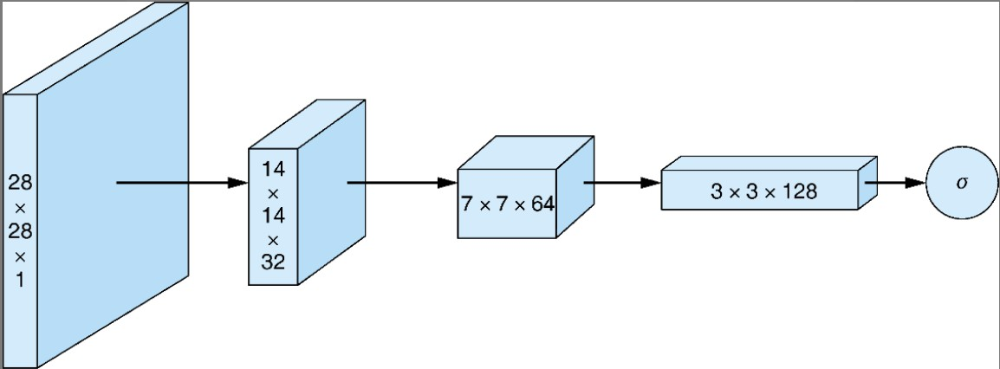

# 第4章 深度卷积生成对抗网络（DGGAN）

第3章实现了一个GAN，其生成器和鉴别器是具有单个隐藏层的简单前馈神经网络。尽管很简单，但GAN的生成器充分训练后得到的手写数字图像的真实性有些还是很具说服力的。

本章中的生成器和鉴别器都将使用卷积神经网络（CNN，或ConvNet），而不再是简单的双层前馈网络。这种GAN架构称为**深度卷积生成对抗网络**（Deep Convolutional GAN，DCGAN）。

## 4.1 卷积神经网络

### 4.1.1 卷积滤波器

常规前馈神经网络的神经元排列在平面的全连接层中，而ConvNet中的层排列在三维（宽×高×深）中。卷积是通过在输入层上滑动一个或多个**滤波器**（filter）来执行的。每个滤波器都有一个相对较小的感受野（宽×高），但它贯穿输入图像的全部深度。

每个滤波器在输入图像上滑动每一步，都会输出一个激活值：它是输入值和过滤器值之间的点积。此过程将为每个滤波器生成一个二维的激活图（activation map）。将每个滤波器生成的激活图堆叠在一起可以形成一个三维输出层，其输出深度等于所用滤波器的数量。

### 4.1.2 参数共享

参数共享能够有效地学习视觉特征和形状。从实际的角度来看，参数共享可以大大减少可训练参数的数量。这降低了过拟合的风险，并允许该技术在不增加可训练参数的情况下扩展到更高分辨率的图像中，而在同样情况下，传统全连接网络却要指数爆炸一样增加可训练参数才可以做到。

### 4.1.3 卷积神经网络可视化

图4.1展示了单个卷积操作：


图4.1描述了二维输入上单个滤波器的卷积运算。一个3×3的卷积滤波器在一个5×5的输入上滑动——从左到右，从上到下。过滤器滑动步长为2，因此一共滑动4次，得到一个2×2的激活图。注意，每次滑动，整个过滤器会生成一个激活值。

实际上，输入图像通常是三维的而且几个滤波器堆叠在一起使用。但基本机制是不变的：不管输入体积的深度如何，每个滤波器每一步产生一个值。使用的滤波器数量决定了输出图像的深度，因为它们生成的激活图相互叠加。

图4.2说明了输入层和输出层都是卷积层情况下的卷积操作：


在激活图（特征图）、整体输入和输出图像中展示的单次卷积步骤的激活值注意：卷积滤波器会贯穿输入图像的整个深度，输出图像的深度是通过激活图堆叠来确定的。

## 4.3 批归一化

**批归一化**：就像对网络输入进行归一化一样，他们建议在每个小批量训练数据通过网络时，对每个层的输入进行归一化。

### 4.3.1 理解归一化

**归一化**（normalization）是数据的缩放，使它具有零均值和单位方差。这是通过取每个数据点$x$减去平均值µ，然后除以标准偏差得到的，如式4.1所示。

$\hat x = \frac{x-\mu}{\sigma}$（式4.1）

归一化有几个优点。最重要的一点或许是**使得具有巨大尺度差异的特征之间的比较变得更容易**，进而使训练过程对特征的尺度不那么敏感。

批归一化背后所体现的理念是，在处理具有多层的深度神经网络时，仅规范化输入可能还远远不够。当输入值经过一层又一层网络时，它们将被每一层中的可训练参数进行缩放。当参数通过反向传播得到调整时，每一层输入的分布在随后的训练迭代中都容易发生变化，从而影响学习过程的稳定性。在学术界，这个问题称为**协变量偏移**（covariate shift）。**批归一化通过按每个小批量的均值和方差缩放每个小批量中的值**来解决该问题。

### 4.3.2 计算批归一化

令$\mu_B$为小批量$B$的平均值，$\sigma_B^2$为小批量$B$的方差（均方误差）。归一化值$B$的计算如式4.2所示：

$\hat x = \frac {x-\mu_B}{\sqrt{\sigma^2 + ε}}$ (式4.2)

增加$ε$项是为了保持数值稳定性，主要是为了避免被零除，一般设置为一较小的正常数，例如0.001。

在批归一化中不直接使用这些归一化值，而是将它们乘以γ并加上β后，再作为输入传递到下一层，如式4.3所示。

$y=\gamma \hat x+\beta$ (式4.3)

重要的是，γ和β项是可训练的参数，就像权重和偏置一样在网络训练期间进行调整。这样做有助于将中间的输入值标准化，使其均值在0附近（但非0）。方差也不是1。

批归一化限制了更新前一层中的参数对当前层接收的输入分布可能的影响。这减少了跨层参数之间不必要的相互依赖，从而有助于加快网络训练并增强鲁棒性，特别是在网络参数初始化方面。

## 4.4 教程：用DCGAN生成手写数字

回顾第3章中的生成MNIST手写数字，这次将使用DCGAN架构，并将生成器和鉴别器都换成卷积网络，如图4.3所示。除此更改外，其余网络结构保持不变。


### 4.4.1 导入模块并制定模型输入维度

首先导入训练和运行模型所需的所有包、模块以及库。直接从keras.datasets导入MNIST手写数字数据集：

```python
# 导入声明
%matplotlib inline

import matplotlib.pyplot as plt
import numpy as np

from keras.datasets import mnist
from keras.layers import Activation, BatchNormalization, Dense, Dropout, Flatten, Reshape
from keras.layers.advanced_activations import LeakyReLU
from keras.layers.convolutional import Conv2D, Conv2DTranspose
from keras.models import Sequential
from keras.optimizers import Adam
```

指定模型输入维度：图像尺寸和噪声向量$z$的长度：

```python
img_rows = 28
img_cols = 28
channels = 1

# 输入图像的维度
image_shape = (img_rows, img_cols, channels)

# 输入生成器的噪声向量的大小
z_dim = 100
```

### 4.4.2 构造生成器

ConvNet传统上用于图像分类任务，图像以尺寸——高度×宽度×彩色通道数作为输入，并通过一系列卷积层输出一个维数为1 ×n的类别得分向量，n是类别标签数。要使用ConvNet结构生成图像，则是上述过程的逆过程：并非获取图像再将其处理为向量，而是**获取向量并调整其大小以使之变为图像**。

这一过程的关键是**转置卷积**（transposed convolution）。我们通常使用卷积减小输入的宽度和高度，同时增加其深度。转置卷积与其相反，用于增加宽度和高度，同时减小深度，如图4.4的生成器网络图所示。


生成器从噪声向量$z$开始，使用一个全连接层将向量重塑为具有小的宽×高和大的深度的三维隐藏层。使用转置卷积对输入进行逐步重塑，以使其宽×高增大而深度减小，直到具有想要合成的图像大小28×28×1。

在每个转置卷积层之后，应用批归一化和**LeakyReLU**激活函数；在最后一层不应用批归一化，并且使用**tanh**激活函数代替ReLU。

综合所有步骤如下：

（1）取一个随机噪声向量$z$，通过全连接层将其重塑为7×7×256张量。

（2）使用转置卷积，将7×7×256张量转换为14×14×128张量。

（3）应用批归一化和**LeakyReLU**激活函数。

（4）使用转置卷积，将14×14×128张量转换为14×14×64张量。注意：宽度和高度尺寸保持不变。可以通过将Conv2DTranspose中的stride参数设置为1来实现。

（5）应用批归一化和**LeakyReLU**激活函数。

（6）使用转置卷积，将14×14×64张量转换为输出图像大小28×28×1。

（7）应用**tanh**激活函数。

在Keras中实现生成器网络：

```python
def build_generator(z_dim):
    model = Sequential()

    # 通过全连接层将输入重新调整大小为7×7×256的张量
    model.add(Dense(256 * 7 * 7, input_dim = z_dim))
    model.add(Reshape((7, 7, 256)))

    # 转置卷积层从大小为7×7×256的张量到14×14×128的张量
    model.add(Conv2DTranspose(128, kernel_size=3, strides=2, padding='same'))

    # 批归一化
    model.add(BatchNormalization())

    # LeakyReLU激活函数
    model.add(LeakyReLU(alpha=0.01))

    # 转置卷积层从大小为14×14×128的张量到14×14×64的张量
    model.add(Conv2DTranspose(64, kernel_size=3, strides=1, padding='same'))

    # 批归一化
    model.add(BatchNormalization())

    # LeakyReLU激活函数
    model.add(LeakyReLU(alpha=0.01))

    # 转置卷积层从大小为14×14×64的张量到28×28×1的张量
    model.add(Conv2DTranspose(1, kernel_size=3, strides=2, padding='same'))

    # 带tanh激活函数的输出层
    model.add(Activation('tanh'))

    return model
```

### 4.4.3 构造鉴别器

鉴别器是一种我们熟悉的ConvNet，它接收图像并输出预测向量：在这种情况下，它是一种二值分类，表明输入的图像是否被认为是真实的而不是假的。图4.5所示的是我们将要实现的鉴别器网络。



鉴别器将28×28×1图像作为输入经过多个卷积层，使用sigmoid激活函数输出σ：输入图像是真实的概率。

鉴别器的输入是28×28×1的图像。应用卷积可以对图像进行变换，使其宽×高逐渐变小，深度逐渐变深。在所有卷积层中使用**LeakyReLU**激活函数；批归一化用于除第一层以外的所有卷积层；输出使用全连接层和**sigmoid**激活函数。

综合所有步骤如下：

（1）使用卷积层将28×28×1的输入图像转换为14×14×32的张量。

（2）应用**LeakyReLU**激活函数。

（3）使用卷积层将14×14×32的张量转换为7×7×64的张量。

（4）应用批归一化和**LeakyReLU**激活函数。

（5）使用卷积层将7×7×64的张量转换为3×3×128的张量。

（6）应用批归一化和**LeakyReLU**激活函数。

（7）将3×3×128张量展成大小为3×3×128=1152的向量。

（8）使用全连接层，输入**sigmoid**激活函数计算输入图像是否真实的概率。

用Keras实现鉴别器：

```python
def build_discriminator(img_shape):

    model = Sequential()

    # 卷积层，从大小为28×28×1的张量到14×14×32的张量
    model.add(Conv2D(32, kernel_size=3, strides=2, input_shape=img_shape, padding='same'))

    # LeakyReLU激活函数
    model.add(LeakyReLU(alpha=0.01))

    # 卷积层，从大小14×14×32的张量到7×7×64的张量
    model.add(Conv2D(64, kernel_size=3, strides=2, input_shape=img_shape, padding='same'))

    # 批归一化
    model.add(BatchNormalization())

    # LeakyReLU激活函数
    model.add(LeakyReLU(alpha=0.01))

    # 卷积层，从大小7×7×64的张量到3×3×128的张量
    model.add(Conv2D(128, kernel_size=3, strides=2, input_shape=img_shape, padding='same'))

    # 批归一化
    model.add(BatchNormalization())

    # LeakyReLU激活函数
    model.add(LeakyReLU(alpha=0.01))

    # 带sigmoid激活函数的输出层
    model.add(Flatten())
    model.add(Dense(1, activation='sigmoid'))

    return model
```

### 4.4.4　构建并运行DCGAN

除了生成器和鉴别器的网络结构，DCGAN的其他设置和实现与第3章中简单GAN的网络相同,这体现了GAN架构的通用性。

构建并编译DCGAN：

```python
def build_gan(generator, discriminator):
    model = Sequential()

    # 生成器和鉴别器结合成一个模型
    model.add(generator)
    model.add(discriminator)

    return model
```

```python
# 构建并编译鉴别器
discriminator = build_discriminator(img_shape)
discriminator.compile(loss='binary_crossentropy',
                                            optimizer=Adam(),
                                            metrics=['accuracy'])

# 构建生成器
generator = build_generator(z_dim)

# 生成器训练时鉴别器参数保持不变
discriminator.trainable = False

# 构建并编译鉴别器固定的GAN模型来训练生成器
gan = build_gan(generator, discriminator)
gan.compile(loss='binary_crossentropy', optimizer=Adam())
```

```python
# 训练DCGAN
losses = []
accuracies = []
iteration_checkpoints = []

def train(iterations, batch_size, sample_interval):

    # 加载MNIST数据
    (X_train, _), (_, _) = mnist.load_data()

    # 灰度像素值从[0，255]缩放到[1，1]
    X_train = X_train / 127.5 - 1.0
    X_train = np.expand_dims(X_train, axis=3)

    # 真实图像标签为1
    real = np.ones(batch_size, 1)

    # 伪图像标签为0
    fake = np.zeros(batch_size, 1)

    for iteration in range(iterations):

        # -------------------------
        #  Train the Discriminator
        # -------------------------

        # 获取一批真实图像
        idx = np.random.randint(0, X_train.shape[0], batch_size)
        imgs = X_train[idx]

        # 生成一批伪图像
        z = np.random.normal(0, 1, (batch_size, 100))
        gen_imgs = generator.predict(z)

        # 训练鉴别器
        d_loss_real = discriminator.train_on_batch(imgs, real)
        d_loss_fake = discriminator.train_on_batch(gen_imgs, fake)
        d_loss, accuracy = 0.5 * np.add(d_loss_real, d_loss_fake)

        # ---------------------
        #  Train the Generator
        # ---------------------

        # 生成一批伪图像
        z = np.random.normal(0, 1, (batch_size, 100))
        gen_imgs = generator.predict(z)

        # 训练生成器
        g_loss = gan.train_on_batch(z, real)

        if(iteration + 1) % sample_interval == 0:

            # Save losses and accuracies so they can be plotted after training
            losses.append((d_loss, g_loss))
            accuracies.append(100.0 * accuracy)
            iteration_checkpoints.append(iteration + 1)

            # 输出训练过程
            print("%d [D loss: %f, acc.: %.2f%%] [G loss: %f]" % 
                        (iteration + 1, d_loss, 100.0 * accuracy, g_loss))
          
            # 输出生成图像的采样
            sample_images(generator)
```

```python
from email.mime import image


def sample_images(generator, image_grid_rows = 4, image_grid_columns = 4):

    # 随机噪声采样
    z = np.random.normal(0, 1, (image_grid_rows * image_grid_columns, z_dim))

    # 从随机噪声生成图像
    gen_imgs = generator.predict(z)

    # 图像像素缩放到[0, 1]
    gen_imgs = 0.5 * gen_imgs + 0.5

    # 设置图像网格
    fig, axs = plt.subplots(image_grid_rows, image_grid_columns,
                                                    figsize=(4, 4),
                                                    sharey=True,
                                                    sharex=True)
  
    cnt = 0
    for i in range(image_grid_rows):
        for j in range(image_grid_columns):
            # 输出图像网格
            axs[i, j].imshow(gen_imgs[cnt, :, :, 0], cmap='gray')
            axs[i, j].axis('off')
            cnt += 1
```

运行模型：

```python
# 运行模型

# 设置超参数
iterations = 20000
batch_size = 128
sample_interval = 1000

# 训练DCGAN直到制定的迭代次数
train(iterations, batch_size, sample_interval)
```

### 4.4.5 模型输出


## 4.5 结论

DCGAN展示了GAN框架的通用性。理论上来说，鉴别器和生成器可以用任何可微函数表示，甚至可以用多层卷积网络这样复杂的函数表示。但是DCGAN也表明，要使更复杂的实现在实践中真正起作用，还存在很大的障碍。没有批归一化等突破性技术，DCGAN将无法正确训练。

## 4.6 小结

（1）卷积神经网络（ConvNet）使用一个或多个在输入图像上滑动的卷积滤波器。在输入图像上滑动的每一步，滤波器都会使用一组参数来产生一个激活值。来自所有滤波器的所有激活值共同生成输出层。

（2）批归一化是指在将每一层的输出作为输入传递到下一层之前，对其进行归一化，以减小神经网络中协变量偏移（训练期间各层之间输入值分布的变化）。

（3）深度卷积生成对抗网络（DCGAN）以卷积神经网络为生成器和鉴别器。本章的代码教程中实现了这种架构，它在图像处理任务（如手写数字生成）中实现了优异的性能。
