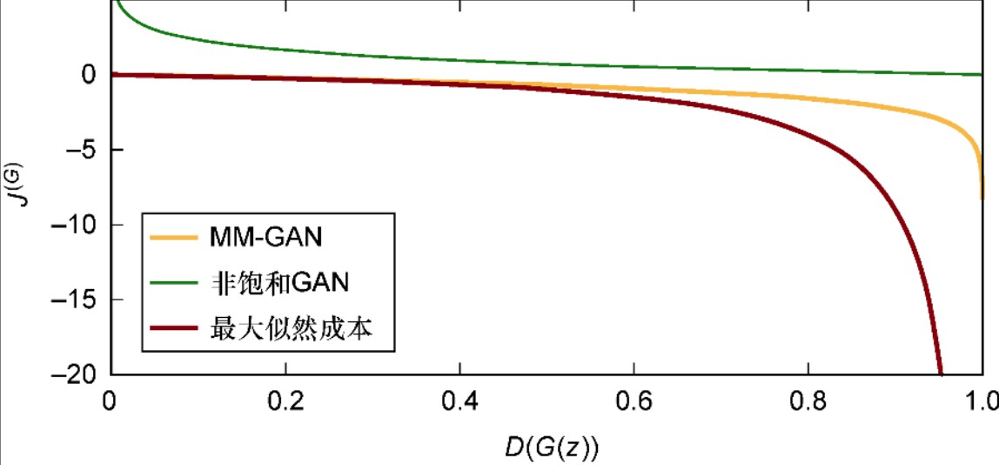
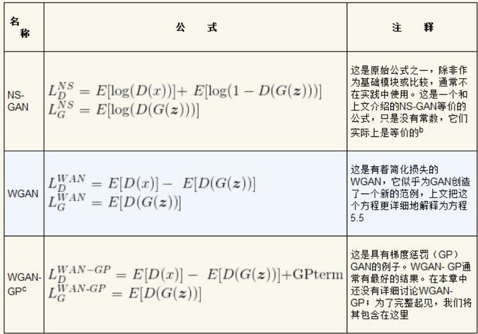

# 第5章 训练与普遍挑战：为成功而GAN

GAN的位置：

上图中有两个关键要点：

（1）所有这些生成模型最终都源自最大似然（maximum likelihood），至少隐式地是这样。

（2）第2章介绍的变分自编码器位于树的显式部分。

图中展示的关键在于：**训练正在从显式和易驾驭的方法转向隐式的方法**。

## 5.1 评估

如果你是一位伪造者，目的是伪造达芬奇的“遗失的作品”，以对达•芬奇风格的完美模仿欺骗艺术评论家，要如何评价自己的做得有多好呢？

### 5.1.1 评估框架

首选解决方案是拥有达•芬奇用他的风格画出的所有可能的作品，然后看看用GAN生成的图像会不会在这个收藏集中。可以将此过程视为最大化最大似然的非近似版本。

次优的解决方案是评估图像并指出对应要检查的地方，然后合计所有错误或伪造的画的数量。这样局限性很大，而且最终总是需要人类评论家来审查作品。

最大似然是统计的方法，可以度量一些模糊的期望，而且不管怎样都能从中得到隐式的结果。最大似然是统计的方法，可以度量一些模糊的期望，而且不管怎样都能从中得到隐式的结果。

实际中，最大似然近似容易过度泛化，因此生成的样本由于太过多样化而显得不真实。

考虑过度泛化的另一种方法是从伪数据和真实数据的概率分布开始，看看距离函数在概率质量为0的情况下的作用。如果这些样本之间没有太大的差异，那么因这些样本过度泛化而造成的额外损失可能很小。

我们必须评估样本，但是又不能简单地使用最大似然。接下来将讨论用于统计评估生成样本质量的两个最常用且公认的度量标准：**Inception Score**（IS）和**Fréchet Inception Distance**（FID）。这两个指标的优点在于，它们已被广泛证实与至少某些期望性质（如图像的视觉吸引力或真实感）高度相关。

### 5.1.2 IS

（1）生成的样本要看起来像真实的可分辨的东西。

（2）生成的样本是多种多样的，并且理想情况下应该包含原始数据集中表示的所有类别。不应该存在类间模式崩溃（interclass mode collapse）。

计算IS的过程很简单：

（1）采用真实分布和生成分布之间的Kullback-Leibler（KL）差异。

（2）对第1步的结果求指数。

### 5.1.3 FID

通常，GAN只能学习到每个类别中的一小部分图像。Fréchet Inception Distance（FID）通过提高对噪声的鲁棒性并检测**类内**（intraclass）样本遗漏来改进IS。

FID的技术实现也很复杂，但背后的高级想法是我们正在寻找一个样本的生成分布，使得为了确保生成分布与真实分布相似而必须进行的修改最小化。

## 5.2 训练中的挑战

（1）**模式崩溃**。在模式崩溃中，某些模式（如某些类）在生成的样本中没有很好地表示出来。即使真实数据分布中有样本分布在这一部分，该模式也崩溃了。

（2）**收敛速度慢**。

（3）**过度泛化**。

在GAN训练方面，下列几种技术可用于改善训练过程：

（1）增加网络深度。

（2）更改网络设置。

### 5.2.1 增加网络深度

我们可以使用简单的生成器和鉴别器来快速实现稳定性，然后在训练时增加复杂性。这种方法具有以下优点：稳定、训练速度快，最重要的是生成样本的质量好、尺寸大。

### 5.2.2 游戏设置

有必要分别研究每个损失函数（胜利指标）和玩家动态（游戏设置）。

### 5.2.3 最小-最大GAN

仅将GAN问题视为一个最小-最大（min-max）博弈。式5.1描述了鉴别器的损失函数。

$J^D=E_{x~p_r}log[D(x)]+E_{z~P_g}log[1-D(G(z))]$ （式5.1）

E代表对x（真实数据分布）或z（潜在空间）的期望，D代表鉴别器的函数（将图像映射到概率），G代表生成器的函数（将潜在向量映射到图像）。任何二元分类问题都应该熟悉这第一个方程。如果给一定的自由并摆脱复杂性，则可以把这个方程改写为：

$J^D=D(x)-D(G(z)),for D(x),D(G(z))\in [0, 1]$

这说明鉴别器正在尝试最大程度地减少将真实样本误认为是伪样本（第一部分）或将伪样本误认为是真实样本（第二部分）的可能性。

现在我们将注意力转向式5.2中生成器的损失函数。

$J^G=-J^D$ （式5.2）

因为只有两方起作用且它们彼此竞争，所以有理由认为生成器的损失对鉴别器来说是负损失。

将它们放在一起：有两个损失函数，而且一个是另一个的负值。这样对抗性就很明显了，生成器试图比鉴别器更聪明。至于鉴别器，请记住它是一个二元分类器，只输出一个数字（而不是两类），因此它会因其可信度或缺乏可信度而受到惩罚。剩下的只是一些花哨的数学运算，这些运算证明了一些很好的性质，例如JS散度的渐近一致性。

JS散度度量了两个概率分布的相似度，它是基于KL散度的变体，解决了KL散度非对称的问题。一般来说，JS散度是对称的。

KL散度和JS散度通常被视为GAN最终在试图最小化的东西。这两种都是距离指标，有助于理解高维空间中两种分布的差异。

### 5.2.4 非饱和GAN

在这一版本中，没有让两个损失函数成为彼此的直接竞争对手，而是使两个损失函数相互独立，如式5.3所示，但在方向上与原始公式（式5.2）一致。

同样让我们专注于一个一般性的解释：这两个损失函数不再直接相互抵消。但是在式5.3中，可以看到生成器正在试图最小化方程式5.4中鉴别器第二项的相反项，它试图让它所生成的样本不被发现（是假的）。

$J^G=E_{z~p_g}log[D(G(z))]$ （式5.3）

$J^G=E_{x~p_r}log[D(x)]+E_{z^-p_g}log[1-D(G(z))]$ （式5.4）

从直观上看，鉴别器与之前完全相同——式5.1和式5.4相同，但是式5.2的等价形式已经变了。使用NS-GAN的主要原因是在MM-GAN的情况下，梯度很容易饱和到接近0，这种情况下，反向传播的权重更新为0或很小，从而导致收敛缓慢。也许下图能更清晰地展示这一点。

可以看到在0.0附近，最大似然和MM-GAN的梯度都接近于0，这是很多早期训练发生的地方；而NS-GAN在0.0附近的梯度要高得多，所以训练在一开始就进行得更快。

对NS变体为什么会收敛到纳什均衡，没有很好的理论解释。实际上，由于NS-GAN是启发性的，因此使用这种形式不再提供过去获得的简洁的数学保证。由于GAN问题的复杂性，即使用NS-GAN训练，也有可能完全不收敛，尽管经验证明它表现得比MM-GAN更好。

但是这种可怕的牺牲带来了性能的显著提升。NS方法的优点不但在于初始训练更快，而且由于生成器学习得更快，鉴别器也学习得更快。这正是我们所期待的，（几乎）所有人在计算和时间上的预算都很紧，当然学习得越快越好。有人认为，在使用固定的计算力时，NS-GAN仍没有被超越，甚至Wasserstein GAN也不能说是一个比它更好的架构。

### 5.2.5 何时停止训练

### 5.2.6 WGAN

**Wasserstein GAN**（WGAN）之所以重要，有以下3个原因：

（1）它显著改进了损失函数，使得损失函数现在可以解释并提供了更清晰的停止标准。

（2）根据经验，WGAN往往可以得到更好的结果。

（3）与许多对GAN的研究不同，WGAN从损失开始就有明确的理论支持，还表明我们试图估计的KL散度在理论上和实践上最终都是不合理的，并在此基础上提出了一种较好的损失函数来解决这一问题。

WGAN使用**推土机距离**（earth mover’s distance）作为损失函数，该函数与生成样本的视觉质量明显相关。

Wasserstein损失，如式5.5所示：

$$
maxE_{x~P_r}[f_{\omega}(x)]-E_{z~P_x}[f_\omega(g_\theta(z))] 式5.5
$$

公式中有函数$f_\omega$，它充当鉴别器。鉴别器试图估计推土机距离，并在[插图]函数的不同（有效）参数下，寻求真实分布（第一项）与生成分布（第二项）之间的最大差异。鉴别器试图让生成器的处境变得最困难——通过查看在共享空间中使用$f_\omega$的不同投影，来最大化生成器必须移动的概率量。

式5.6展示了生成器，它现在必须包括推土机距离：

$$
minE_{x~P_r}[f_\omega(x)-E_{z~p(z)}[f_\omega(g_\theta(z))]]
$$

在此公式中，我们试图最小化真实分布的期望与生成分布的期望之间的距离。介绍WGAN的论文很复杂，但它的要点是$f_\omega$是满足技术约束的函数。

生成器试图解决的问题与之前类似，在这里更详细地介绍一下：

（1）从真实分布$(x~P_r)$或生成分布$[x*(g_\theta(z)),其中z~p(z)]$中取$x$；

（2）生成样本是从$z$（潜在空间）中采样，通过$g_\theta$进行变换以在同一空间中获得样本$(x^*)$，然后使用$f_\omega$进行评估；

（3）试图最小化损失函数或距离函数，本例中是推土机距离。实际的数是用推土机距离计算出来的，我们稍后会加以解释。

在WGAN中必须设置一个裁剪常数（clipping constant），其作用类似于标准机器学习中的学习率。WGAN有如下两个实际意义。

（1）有更清晰的停止标准，因为该GAN已被后来许多论文所验证，它们显示了鉴别器损失与感知质量之间的相关性。可以简单地测量Wasserstein距离，这有助于告知何时停止训练。

（2）可以训练WGAN直至收敛。这是相关的，因为有meta-review论文表明，使用JS损失和真实分布中生成器之间的差异来衡量训练进度通常是没有意义的。换言之，在国际象棋中有时需要输掉几个回合，暂时表现变差，以便在几次迭代中学习并最终做得更好。

推土机距离具有比JS散度或KL散度更好的性能，并且已经在WGAN的基础上有了重要的贡献，同时也验证了它的卓越性能。

## 5.3 总结游戏设置

GAN结构的3个核心版本：最小-最大GAN、非饱和GAN和WGAN。

表5.1列出了本书用到的NS-GAN、WGAN甚至改进的WGAN-GP的公式：

## 5.4 训练技巧

### 5.4.1 输入的归一化

将图像归一化在–1和1之间通常情况下是一个好主意。之所以进行归一化操作，是因为计算更容易处理，机器学习的其余情况也是如此。考虑到对输入的这种限制，最好使用tanh激活函数来限制生成器的最终输出。

### 5.4.2 批归一化

最初批归一化被认为是一种非常成功的技术；但最近研究表明，它**有时**会产生不好的结果，特别是在生成器中，但在鉴别器中，大多对提升结果有帮助。

### 5.4.3 梯度惩罚

### 5.4.4 对鉴别器进行更多的训练

最近，对鉴别器进行更多的训练是一种成功的方法。主要有两种方法：

（1）在生成器有机会生成任何样本之前对鉴别器进行预训练；

（2）每个训练周期更多次地更新鉴别器，通常，鉴别器权重更新5次，生成器才更新1次。

### 5.4.5　避免稀疏梯度

从直觉上讲，稀疏梯度（如ReLU或MaxPool生成的梯度）会增加训练难度是有道理的。原因如下：

（1）直觉，尤其是平均池化。如果使用标准的最大池化，那么将会失去**除了卷积的感受野中的最大值以外的所有值**，这使得在DCGAN的情况下使用转置卷积来恢复信息变得更加困难。使用平均池化至少可以知道**平均值**是多少。

（2）如果使用ReLU激活，则会导致另一个问题——信息损失。解决此问题的一种方法是应用此操作时考虑丢失了多少信息，因为稍后可能需要恢复它。

对于这两种问题，都有简单的解决方案：可以使用LeakyReLU激活函数，平均池化也可以解决很多这些问题。还有其他激活函数（例如sigmoid、ELU和tanh）。

### 5.4.6 平滑和带噪声的标签

研究人员使用多种方法来给标签添加噪声或使其平滑。

## 5.5 小结

（1）通过学习本章内容，你应能了解“评估对于生成模型而言是一个如此困难的主题”的原因，以及能够在有明确停止标准的情况下训练GAN的方法。

（2）各种评估技术超越了对分布的简单统计评估，并提供了与样本视觉质量相关的更有用的信息。

（3）训练分为3种结构设置：博弈论的最小-最大GAN、启发性的非饱和GAN和最新的以及理论上有据可查的沃瑟斯坦GAN。

（4）能够使训练更快的技巧如下。

归一化输入，这是机器学习中的标准做法。

使用梯度惩罚令训练更具稳定性。

预训练鉴别器可以提供良好的生成器，这样会为生成的样本设置更高的标准。

避免稀疏梯度，因为它们会丢失太多信息。

使用平滑和带有噪声的标签，而不是典型的二分类标签。
